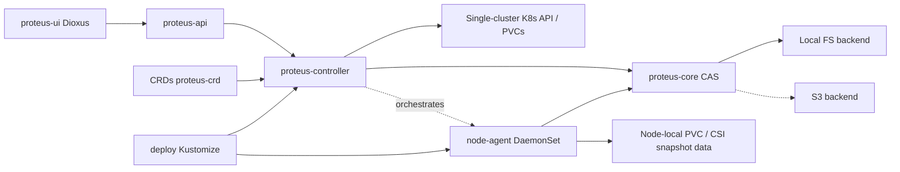

# Architecture

The macro technical shape: the stack, how the pieces fit, and the decisions behind them. Point to the code, do not restate it.

## Stack

- Rust (edition 2021), Tokio — backup I/O and operator runtime
- Kubernetes operator via `kube` / `kube-derive` / `k8s-openapi`
- Axum + `rust-embed` for HTTP API and embedded UI assets
- Dioxus WASM UI in `crates/proteus-ui` (100% Rust source; wasm-bindgen glue only)
- BLAKE3 + AES-256-GCM + fixed-size chunking in `proteus-core`
- Ship path: Docker image + Kustomize (`deploy/`)

## How it fits together

Production bulk I/O for S3-compatible repositories runs on the **node-agent** DaemonSet + mover Pods when a Ready agent sits on the PVC’s node; otherwise mount-Pod + kube-exec remains the fallback (and is forced for Local emptyDir repos). See [ADR 0001](../adr/0001-production-data-plane.md). Status records `dataPlane` / `assignedNode`.

## Key decisions

- One binary embeds API + UI so day-2 ops share process fate and cluster credentials with the operator
- UI is Dioxus WASM — no Node frontend in the repo
- Product UX inspired by Kopia; runtime is Kube-native CRs + controller
- Users install via container image and/or `kubectl apply -k`
- MVP is single-cluster and PVC-centric
- **Data plane (shipping):** DaemonSet `proteus-node-agent` + mover Pods for remote repos; exec fallback — [ADR 0001](../adr/0001-production-data-plane.md) / epic #66 (CSI snapshots still later)
- Prefer one image with controller vs agent/mover modes over a second unrelated image
- Libraries use `thiserror`; only the binary edge uses `anyhow`
- CRD API group `proteus.io`, version `v1alpha1` until GA
- Backup recipe vs run: `ProteusBackupPolicy` (idempotent) + `ProteusBackup` (one execution, optional `policyRef`); schedules (#16) should spawn runs from policies

## Gotchas

- S3 CAS uses `object_store` (MinIO-compatible); reconcile probes with `list` under prefix
- Build UI with `just build-ui` before embedding real assets
- Host `cargo test/clippy --workspace` should `--exclude proteus-ui` (WASM target); prefer `just check`
- `PROTEUS_API_ADDR` defaults to `0.0.0.0:8080`
- Day-to-day commands: root `Justfile` (`just run`, `just deploy`, `just pf`)
- S3 credentials Secret keys: `accessKeyId`/`secretAccessKey` (or AWS_/snake_case aliases); see `deploy/README.md`
