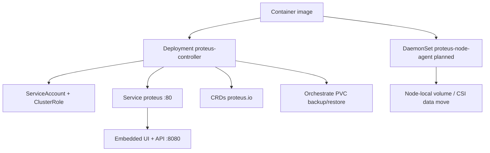

# Deployment

How Proteus is built and shipped to a Kubernetes cluster.

## Tooling

- Container image: multi-stage `deploy/Dockerfile` (Dioxus WASM UI → Rust release → distroless runtime)
- Cluster install: Kustomize under `deploy/` (`base` + `overlays/default`) — **no Helm**
- CRDs live in `deploy/crds/` and are applied with the base
- Image registry: `ghcr.io/craftingtech/proteus-controller` (CI multi-arch `amd64`/`arm64`)

## Topology

Controller Deployment is shipping today. **Node-agent DaemonSet** is the accepted production data-plane install shape ([ADR 0001](../adr/0001-production-data-plane.md)); not yet in `deploy/` manifests.

## Conventions

- Image name default: `ghcr.io/craftingtech/proteus-controller:<tag>` (controller and future agent modes share this image)
- Tip install: `kubectl apply -k deploy/overlays/default` (pins `:main`)
- Release install: apply overlay at git tag `vX.Y.Z`, then `kubectl set image` to `:X.Y.Z` (tag-first; no bump commits)
- Image build ARG `PROTEUS_VERSION` bakes release semver into `CARGO_PKG_VERSION`
- Local repo data path in-cluster: `/var/lib/proteus` (emptyDir in base; replace with PVC for persistence)
- GitOps: consumers may Argo-source this repo (`path: deploy/overlays/default`) or vendor `deploy/` into their own GitOps repo; Ingress is a consumer overlay
- Large-PVC throughput: deploy agent (and CSI when testing snapshots); `just run` alone stays exec/fallback
