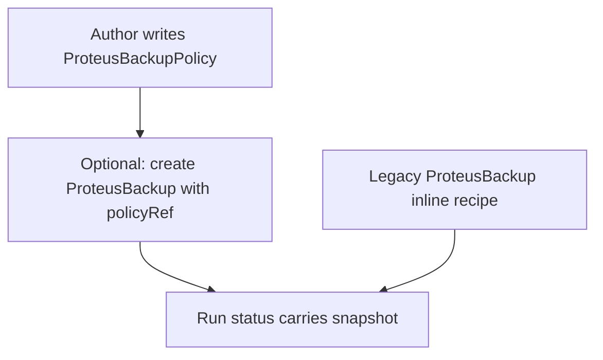

# Instruction: CRD BackupPolicy + run policyRef

## Architecture projection

> Tree of the final files. ✅ create · ✏️ modify · ❌ delete

```txt
crates/proteus-crd/src/
  ✅ backup_policy.rs
  ✏️ backup.rs          # policyRef; deprecate schedule printcolumn → Policy
  ✏️ lib.rs
  ✏️ bin/proteus-crdgen.rs
deploy/crds/
  ✅ proteusbackuppolicies.yaml
  ✏️ proteusbackups.yaml
```

## User Journey



## Tasks to do

### `1)` ProteusBackupPolicy CRD

> Idempotent recipe CR; no execution semantics in status beyond readiness/validation.

1. Add `ProteusBackupPolicy` / `proteusbackuppolicies` / shortname `pbackuppolicy`
2. Spec: `repositoryRef`, optional `repositoryNamespace`, `targetNamespace`, `pvcNames` (≥1), optional `labelSelector`, optional `schedule` (unused until #16), `retention`, `includeVolumes`, `includeClusterResources`
3. Status: light — `Ready`/`Invalid` (+ message) only; no snapshot fields
4. Move/`pub use` `RetentionPolicy` so Policy and legacy Backup share one type
5. Regenerate CRD YAML via crdgen

### `2)` ProteusBackup as run

> Run references a policy or keeps inline recipe for compat.

1. Add optional `policyRef` (+ optional `policyNamespace`)
2. When `policyRef` set: inline recipe fields optional at schema level where kube/schemars allow; document that controller prefers policy
3. Keep existing status (phase, snapshot, metrics) unchanged
4. Adjust printcolumns: Phase primary; drop or keep Schedule only if still on run (prefer Policy column / omit)

## Test acceptance criteria

| Task | Acceptance criteria |
| ---- | ------------------- |
| 1 | `cargo run -p proteus-crd --bin proteus-crdgen` emits Policy CRD; kind installs with recipe fields + Ready/Invalid status |
| 2 | Existing sample Backup YAML still deserializes; new Backup with only `policyRef` is a valid typed object |
