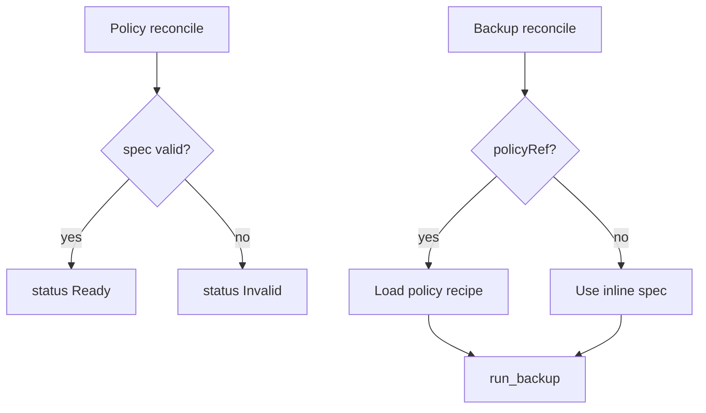

# Instruction: Controller policy validate + resolve recipe

## Architecture projection

```txt
crates/proteus-controller/src/controllers/
  ✅ backup_policy.rs
  ✏️ backup.rs          # resolve_recipe(policyRef | inline)
  ✏️ mod.rs             # wire Policy controller
crates/proteus-controller/src/backup/
  ✏️ mod.rs             # accept resolved recipe, not raw CR fields only
```

## User Journey



## Tasks to do

### `1)` Policy reconciler

> Validate only; never start a backup.

1. `reconcile_backup_policy`: validate repo ref, targetNs, pvcNames, keepLast
2. Patch status Ready / Invalid + message
3. Requeue calmly; no call into `run_backup`
4. Unit tests for validate paths

### `2)` Backup recipe resolution

> Runs execute a resolved recipe; policy edits do not re-trigger terminal runs.

1. Extract `BackupRecipe` (or equiv) from policy or inline Backup spec
2. Fail run clearly if `policyRef` missing / Invalid / wrong ns
3. Terminal Succeeded/Failed short-circuit unchanged (no re-run on policy edit)
4. Unit tests: resolve policy vs inline; Invalid policy → Failed message

## Test acceptance criteria

| Task | Acceptance criteria |
| ---- | ------------------- |
| 1 | Editing a Ready policy’s pvc list updates status only; no new ProteusBackup appears |
| 2 | Backup with policyRef of Ready policy reaches run_backup with that recipe; missing policy → Failed with explicit message; legacy inline Backup still runs |
