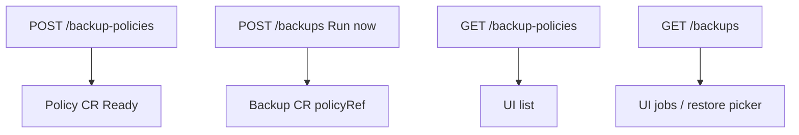

# Instruction: API policies CRUD + Run now

## Architecture projection

```txt
crates/proteus-api/src/resources/
  ✅ backup_policies.rs
  ✏️ backups.rs         # create run from policyRef; list still runs
  ✏️ mod.rs
  ✏️ counts / repo_store if needed
crates/proteus-api/src/
  ✏️ routes.rs
```

## User Journey



## Tasks to do

### `1)` Backup policies API

> CRUD for recipes; create does not start a run.

1. `GET/POST /api/v1/backup-policies`, `DELETE /api/v1/backup-policies/{ns}/{name}`
2. DTOs: list item (phase/message, repo, pvcs, retention summary), create request (name, ns, recipe fields)
3. `build_policy` mirrors today’s backup builder constraints (pvc ≥1, ns default)
4. Unit tests for build + validation

### `2)` Run now on backups API

> Creating a backup is an invocation, preferably from a policy.

1. Extend `CreateBackupRequest` with `policyRef` / `policyNamespace` (required for new UI path)
2. When policyRef set: create ProteusBackup with policyRef only (no duplicated recipe), generate run name if needed (`{policy}-YYYYMMDDhhmmss` or similar)
3. Keep minimal inline create only if useful for tests/compat; prefer policy path in handlers used by UI
4. List/delete/GC unchanged on run CRs; refresh_counts may add policy count later (optional)

## Test acceptance criteria

| Task | Acceptance criteria |
| ---- | ------------------- |
| 1 | POST policy creates CR without any new Backup; GET lists it; DELETE removes it |
| 2 | POST backup with policyRef creates a run CR that reconciles; restore still uses backup name/`lastSnapshotId` |
