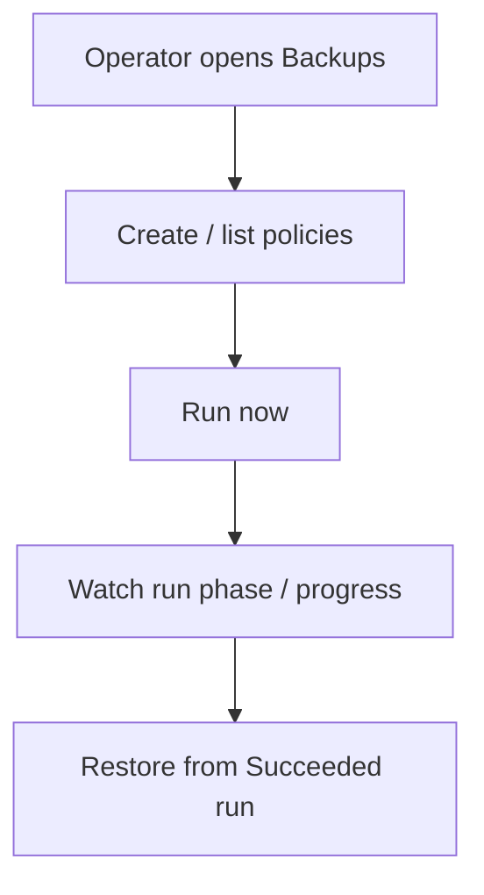

# Instruction: UI policies vs runs

## Architecture projection

```txt
crates/proteus-ui/src/
  ✏️ api.rs
  ✏️ pages/backups.rs   # or split policies section / module (prefer small extract if file already large)
  ✏️ pages/mod.rs       # only if new route
```

## User Journey



## Wireframe

```txt
┌──────────────────────────────────────────────────────────────┐
│ (1) Backups                                                  │
├──────────────────────────────────────────────────────────────┤
│ (2) Policies                          [ New policy ]         │
│  ┌────────────────────────────────────────────────────────┐  │
│  │ name · ns · repo · PVCs · retention · Ready · [Run now]│  │
│  └────────────────────────────────────────────────────────┘  │
├──────────────────────────────────────────────────────────────┤
│ (3) Runs / jobs                                              │
│  ┌────────────────────────────────────────────────────────┐  │
│  │ name · policy · phase · progress · snapshot · [Delete] │  │
│  └────────────────────────────────────────────────────────┘  │
├──────────────────────────────────────────────────────────────┤
│ (4) Restore (unchanged region: pick Succeeded run)           │
└──────────────────────────────────────────────────────────────┘

┌──────────────────────────────────────┐
│ (5) New policy (form)                │
│  name · namespace · repo · PVC checks │
│  [Create policy]                     │
└──────────────────────────────────────┘
```

1. Page title / existing nav entry.
2. Policy list = recipes; Run now creates a run, never edits recipe into a run.
3. Runs = today’s job list (phase, progress, delete).
4. Restore still picks a Succeeded **run**.
5. Form creates a policy only (no automatic run unless we add an explicit “Create & run” later — out of scope).

## Tasks to do

### `1)` API client + page split

> Surface policies and runs as two lists on the backups page.

1. Client: list/create/delete policies; create backup with policyRef for Run now
2. Replace “New backup” form with “New policy”
3. Per-policy Run now → POST run; show errors
4. Keep restore picker on Succeeded runs
5. Extract helpers if `backups.rs` grows past SRP comfort (align #55 spirit, minimal)

## Test acceptance criteria

| Task | Acceptance criteria |
| ---- | ------------------- |
| 1 | Create policy → appears Ready, no new run; Run now → run appears and progresses; edit is N/A in UI for now but API/CR edit of policy does not spawn runs; restore from Succeeded run still works |
