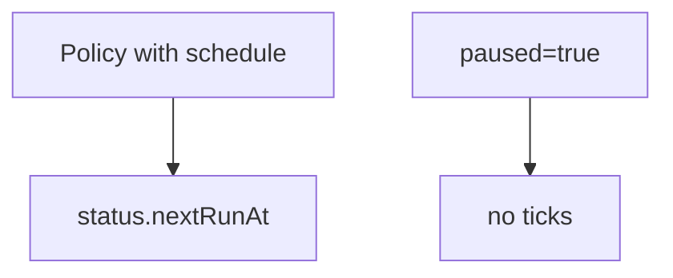

# Instruction: CRD pause + schedule status

## Architecture projection

```txt
crates/proteus-crd/src/
  ✏️ backup_policy.rs
  ✏️ bin/proteus-crdgen.rs
deploy/crds/
  ✏️ proteusbackuppolicies.yaml
```

## User Journey



## Tasks to do

### `1)` Spec + status fields

> Enable pause and surface schedule progress on the policy status.

1. Add `spec.paused: bool` (default false)
2. Status: `next_run_at`, `last_schedule_time`, `last_run_name` (Option String, RFC3339 for times)
3. Printcolumn optional: Schedule / Next
4. Regenerate CRD YAML

## Test acceptance criteria

| Task | Acceptance criteria |
| ---- | ------------------- |
| 1 | Policy YAML with `paused: true` and empty schedule status deserializes; crdgen emits new fields |
