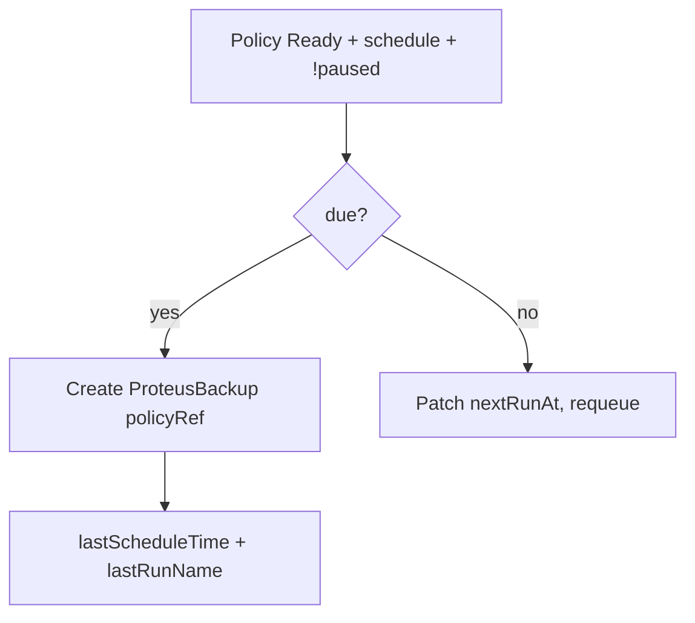

# Instruction: Controller cron tick → spawn run

## Architecture projection

```txt
Cargo.toml                          # ✏️ add cron (workspace)
crates/proteus-controller/
  ✅ schedule.rs                    # parse cron, next/prev tick
  ✏️ controllers/backup_policy.rs   # tick + create ProteusBackup
  ✏️ Cargo.toml
```

## User Journey



## Tasks to do

### `1)` Cron helper

> Parse 5-field cron (UTC); compute next after `from`; reject invalid in validate.

1. Add workspace dep `cron`
2. `parse_schedule` / `next_run_after` helpers + unit tests
3. Invalid schedule → policy Invalid (extend validate_policy_spec)

### `2)` Spawn run on tick

> When due, create one run; never spawn while a prior run for this policy is Pending/Running.

1. List backups in policy ns (or cluster) filtered by policyRef+policyNamespace
2. If any non-terminal → set message, requeue soon, do not spawn
3. Else create ProteusBackup (share naming with API: `{policy}-{YYYYMMDDHHMMSS}`)
4. Update lastScheduleTime / lastRunName / nextRunAt
5. Requeue until nextRunAt (cap e.g. 5m when far)

## Test acceptance criteria

| Task | Acceptance criteria |
| ---- | ------------------- |
| 1 | Valid cron parses; bad cron fails validate; next_run_after is deterministic in tests |
| 2 | Due Ready policy creates exactly one Backup with policyRef; paused/Invalid create none; Running sibling blocks second spawn |
