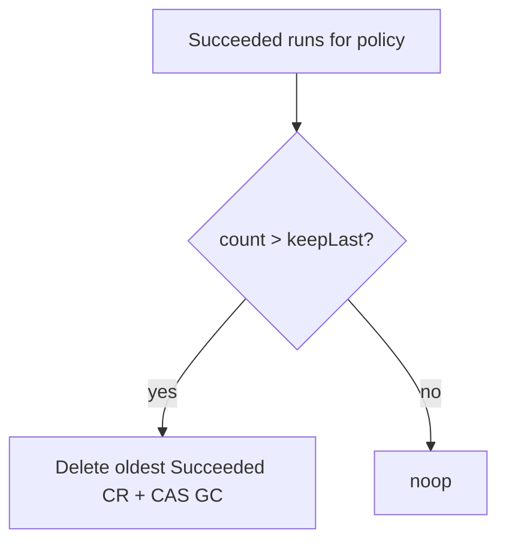

# Instruction: keepLast prune + GC

## Architecture projection

```txt
crates/proteus-controller/src/
  ✅ retention.rs                   # or under backup/
  ✏️ controllers/backup_policy.rs   # after tick, prune
crates/proteus-api/                 # reuse GC patterns if needed from controller via kube delete + core GC
```

## User Journey



## Tasks to do

### `1)` keepLast enforcement

> After schedule reconcile (and safe on every Ready policy), prune excess Succeeded runs for this policy.

1. List Succeeded backups with matching policyRef (+ ns)
2. Sort by last_success_at / creationTimestamp descending
3. Delete oldest beyond `retention.keep_last`
4. On delete: GC unreferenced objects in that repo (mirror API delete path — prefer calling shared core `gc_unreferenced` from controller; do not leave orphaned blobs)
5. Never delete Pending/Running/Failed as part of keepLast
6. Unit tests for selection logic (pure fn)

## Test acceptance criteria

| Task | Acceptance criteria |
| ---- | ------------------- |
| 1 | keepLast=2 with 3 Succeeded → oldest deleted; shared chunks of newer runs kept; Running not pruned |
