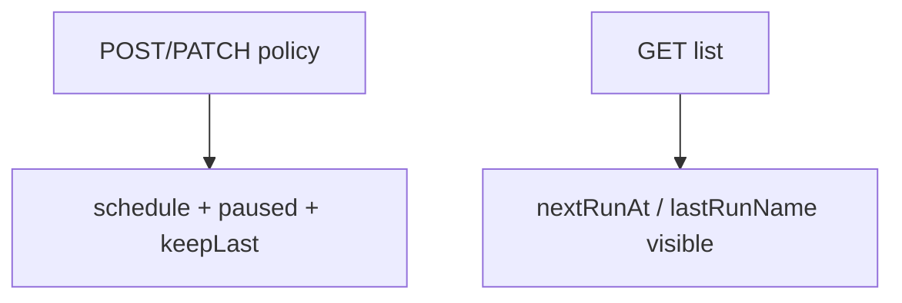

# Instruction: API patch + schedule fields

## Architecture projection

```txt
crates/proteus-api/src/resources/
  ✏️ backup_policies.rs
  ✏️ mod.rs
crates/proteus-api/src/
  ✏️ routes.rs
```

## User Journey



## Tasks to do

### `1)` Expose schedule lifecycle

> List/create already have schedule/keepLast; add pause + status + PATCH.

1. List item: `paused`, `nextRunAt`, `lastScheduleTime`, `lastRunName`
2. Create request: `paused` optional
3. `PATCH /api/v1/backup-policies/{ns}/{name}` — schedule, paused, retention, pvcNames (narrow patch, not full replace)
4. Validate cron on create/patch (same rules as controller)
5. Unit tests for patch merge + bad cron

## Test acceptance criteria

| Task | Acceptance criteria |
| ---- | ------------------- |
| 1 | PATCH paused=true persists; list shows nextRunAt when controller has set it; bad cron rejected on create/patch |
