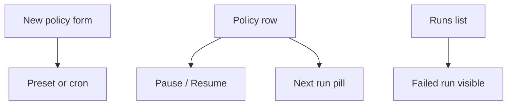

# Instruction: UI presets, pause, next run

## Architecture projection

```txt
crates/proteus-ui/src/
  ✏️ api.rs
  ✏️ pages/backups.rs
```

## User Journey



## Wireframe

```txt
┌──────────────────────────────────────────────────────────────┐
│ (1) New backup policy                                        │
│  name · ns · repo · PVCs                                     │
│  Schedule: [ Off | Hourly | Daily 02:00 | Weekly | Custom ]  │
│  Custom cron: [ 0 2 * * * ]   keepLast: [ 7 ]                │
│  [ Create policy ]                                           │
├──────────────────────────────────────────────────────────────┤
│ (2) Policies                                                 │
│  name · schedule · next · keep · Ready · [Run] [Pause] [Del] │
├──────────────────────────────────────────────────────────────┤
│ (3) Runs (existing) — Failed/Succeeded with policy: pill     │
└──────────────────────────────────────────────────────────────┘
```

1. Form adds schedule presets + keepLast (default 7).
2. Row shows next run; Pause toggles via PATCH.
3. Failures already surface as Failed runs.

## Tasks to do

### `1)` Wire schedule UX

> Operators can schedule without YAML and pause without delete.

1. Client: patch policy; list fields for next/paused/schedule
2. Form: preset → cron string; custom cron input; keepLast
3. Row: next run, Pause/Resume, show schedule text
4. Keep Run now for Ready policies

## Test acceptance criteria

| Task | Acceptance criteria |
| ---- | ------------------- |
| 1 | Create policy with Daily preset → schedule set; Pause → no new scheduled runs; Resume restores; Failed scheduled run visible in Runs |
