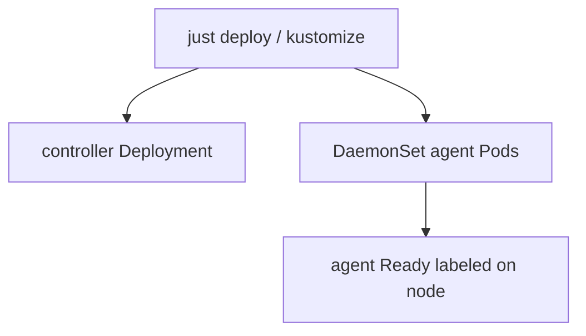

# Instruction: Binary modes + DaemonSet skeleton

## Architecture projection

```txt
crates/proteus-controller/src/
  main.rs                 ✏️ dispatch controller | agent
  agent/
    mod.rs                ✅ agent run loop (Ready heartbeat)
deploy/base/
  daemonset.yaml          ✅ proteus-node-agent
  sa-agent.yaml           ✅
  clusterrole-agent.yaml  ✅
  clusterrolebinding-agent.yaml ✅
  kustomization.yaml      ✏️ include agent resources
```

## User Journey



## Tasks to do

### `1)` CLI mode dispatch

> Default process stays controller+API; `agent` starts node-agent loop.

1. Parse argv: no arg / unknown → controller; `agent` → agent module
2. Agent: build kube client, read `NODE_NAME`, log ready, heartbeat loop (phase 2 expands)

### `2)` Deploy DaemonSet + RBAC

> Cluster install ships agent beside controller.

1. SA + ClusterRole + Binding for agent
2. DaemonSet same image, `args: ["agent"]`, `NODE_NAME` from fieldRef
3. Wire into base kustomization

## Test acceptance criteria

| Task | Acceptance criteria |
| ---- | ------------------- |
| 1 | `proteus-controller agent` starts without launching the HTTP API |
| 2 | `kubectl kustomize deploy/overlays/default` includes DaemonSet `proteus-node-agent` |
