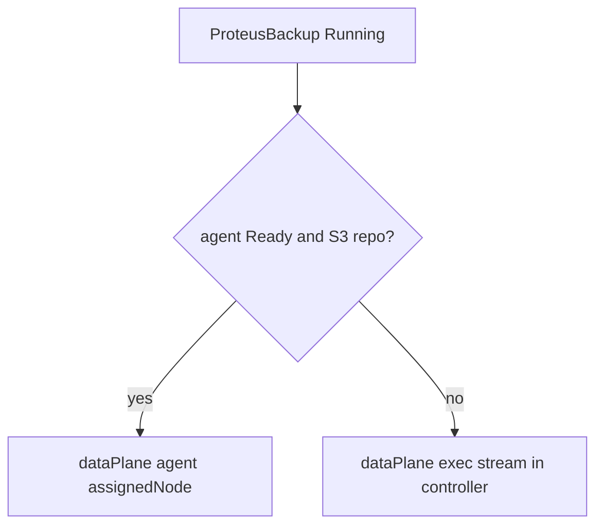

# Instruction: dataPlane status + plane selection

## Architecture projection

```txt
crates/proteus-crd/src/backup.rs    ✏️ dataPlane, assignedNode
crates/proteus-crd/src/restore.rs   ✏️ dataPlane, assignedNode, throughput
deploy/crds/                        ✏️ regenerated
crates/proteus-controller/src/
  data_plane/
    mod.rs                          ✅ select plane, resolve node, list ready agents
  controllers/backup.rs             ✏️ assign or exec
  controllers/restore.rs            ✏️ assign or exec
  agent/mod.rs                      ✏️ Ready label / heartbeat
```

## User Journey



## Tasks to do

### `1)` CRD status fields

> Backup and Restore expose which plane ran.

1. Add `dataPlane`, `assignedNode`; ensure Restore has duration/throughput
2. `just crds`

### `2)` Plane selection + agent Ready

> Shared helper: Local→exec; Ready agent on PVC node→agent; else exec.

1. Agent patches its Pod with Ready signal + nodeName
2. Controller uses helper before bulk I/O

## Test acceptance criteria

| Task | Acceptance criteria |
| ---- | ------------------- |
| 1 | CRD YAML contains dataPlane on Backup and Restore status |
| 2 | Unit tests: Local→exec, no agent→exec, Ready agent+S3→agent |
