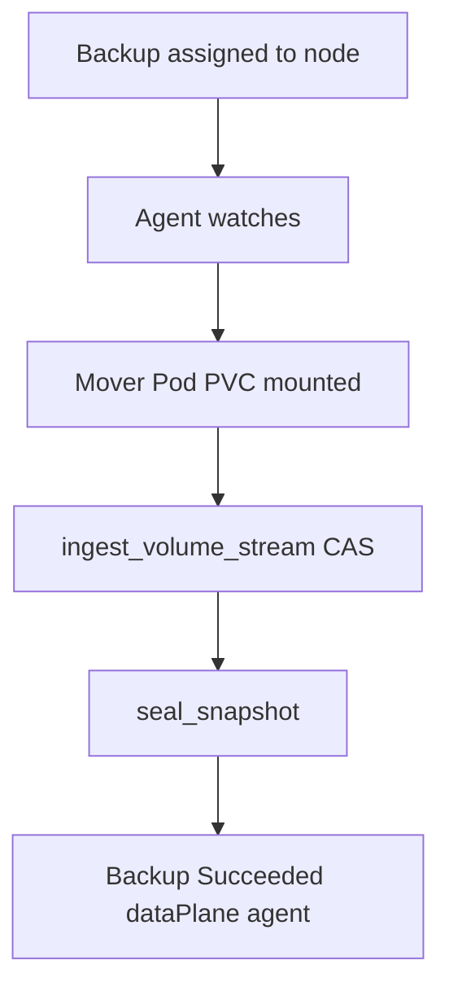

# Instruction: Agent backup + mover ingest

## Architecture projection

```txt
crates/proteus-controller/src/
  agent/
    mod.rs           ✏️ watch assigned Backups
    backup.rs        ✅ claim + spawn movers + seal
  mover/
    mod.rs           ✅ CLI mover backup path
  data_plane/exec.rs ✅ current pvc_reader path extracted
  backup/mod.rs      ✏️ dispatch exec vs wait-for-agent
```

## User Journey



## Tasks to do

### `1)` Mover backup binary path

> Same image runs ingest on the node with PVC mounted at `/data`.

1. `proteus-controller mover backup …` args
2. Open repo from env/secret refs → stream → exit codes

### `2)` Agent orchestrates backup movers

> Watch assigned Backups; create movers; patch status; seal.

1. Per-PVC mover Pod, nodeName fixed
2. Controller observes terminal status when dataPlane=agent

## Test acceptance criteria

| Task | Acceptance criteria |
| ---- | ------------------- |
| 1 | Mover can be invoked with `--help`/args without starting API |
| 2 | On cluster with agent+S3: Backup reaches Succeeded with dataPlane=agent |
