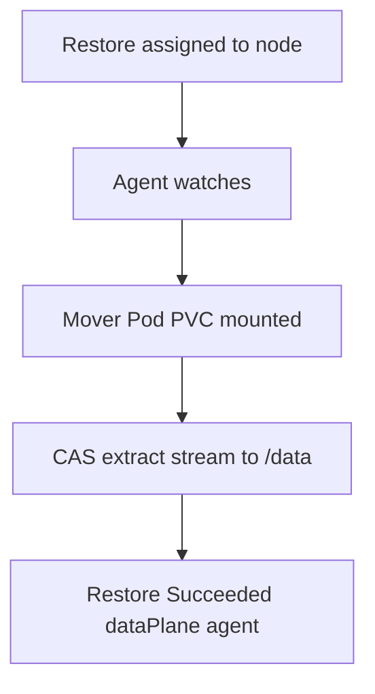

# Instruction: Agent restore + mover extract

## Architecture projection

```txt
crates/proteus-controller/src/
  agent/restore.rs     ✅ watch assigned Restores
  mover/mod.rs         ✏️ restore extract path
  restore/pvc_writer.rs ✏️ exec path only when dataPlane=exec
  data_plane/          ✏️ restore selection already from phase 2
```

## User Journey



## Tasks to do

### `1)` Mover restore path

> CAS → local FS without apiserver bulk or full-archive Vec.

1. `proteus-controller mover restore …`
2. Stream extract to mounted PVC at `/volumes/<pvcName>`

### `2)` Agent orchestrates restore movers

> Mirror backup assignment/watch/cleanup.

1. Watch ProteusRestore assigned to node
2. Metrics duration/throughput + dataPlane=agent

## Test acceptance criteria

| Task | Acceptance criteria |
| ---- | ------------------- |
| 1 | Restore mover writes snapshot data to `/volumes/<pvc>` without kube-exec or full-volume buffer |
| 2 | Cluster: Restore Succeeded with dataPlane=agent after agent Backup |
