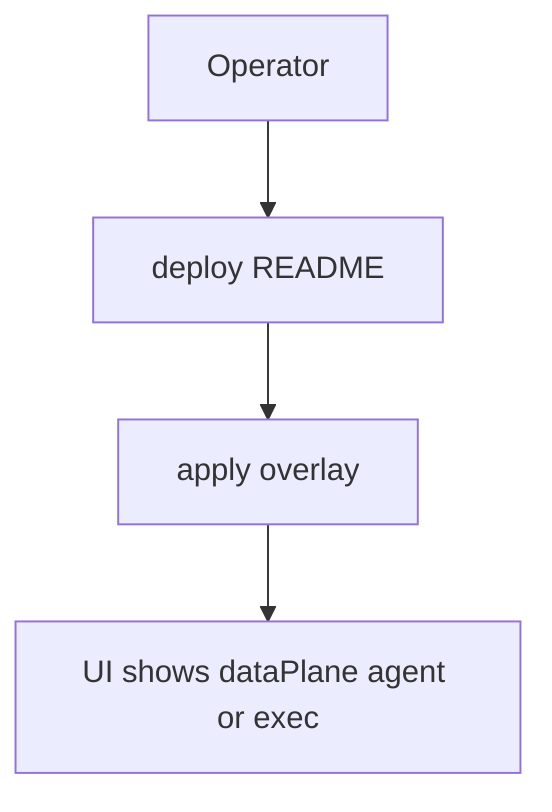

# Instruction: Docs + API/UI + unit tests

## Architecture projection

```txt
deploy/README.md                    ✏️ agent install + plane matrix
aidd_docs/memory/architecture.md    ✏️ agent shipping note
aidd_docs/memory/deployment.md      ✏️ DaemonSet
crates/proteus-api/                 ✏️ expose dataPlane fields
crates/proteus-ui/                  ✏️ show dataPlane on runs
```

## User Journey



## Tasks to do

### `1)` Docs + memory

> Install story and when exec vs agent applies (incl. Local repo).

### `2)` API/UI + unit tests

> Surface dataPlane; unit-test plane selection for backup and restore.

## Test acceptance criteria

| Task | Acceptance criteria |
| ---- | ------------------- |
| 1 | deploy README documents DaemonSet + set-image still works |
| 2 | UI/API list/detail include dataPlane; plane-selection tests pass |
