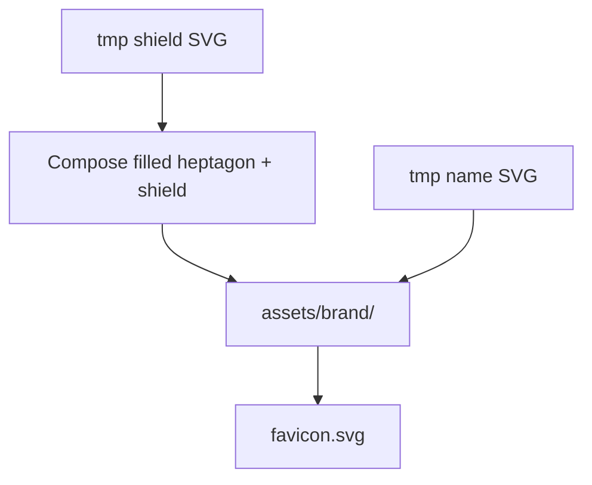

# Instruction: Brand assets (heptagon mark + wordmark + favicon)

## Architecture projection

> Tree of the final files. ✅ create · ✏️ modify · ❌ delete

```txt
crates/proteus-ui/assets/
├── brand/
│   ├── mark-kube.svg          ✅ heptagon+shield, fill #3069de
│   ├── mark-white.svg         ✅ heptagon+shield for dark chrome
│   ├── mark-teal.svg          ✅ mark tinted for teal theme (or currentColor)
│   ├── mark-amber.svg         ✅ mark tinted for amber theme (or currentColor)
│   ├── wordmark-kube.svg      ✅ from name/3069de (cleaned viewBox)
│   ├── wordmark-white.svg     ✅ from name/white
│   └── README.md              ✅ what each file is + usage
├── favicon.svg                ✅ mark (white or kube on transparent)
styles.css                     (phase 2)
src/shell.rs                   (phase 3)
```

Prefer **one mark SVG using `currentColor`** if it stays crisp; otherwise per-theme fills as above.

## User Journey



## Tasks to do

### `1)` Compose heptagon mark

> Filled regular heptagon containing the shield paths; export theme variants or currentColor.

1. Build heptagon geometry (Kube-like orientation)
2. Place / scale shield from `tmp/proteus/shield` centered inside
3. Export mark assets into `assets/brand/`
4. Sanity-check at ~28px and ~16px; simplify paths if muddy

### `2)` Import wordmark

> Name SVG with heptagon O; tight viewBox; kube + white (and currentColor if viable).

1. Copy/clean `name/*.svg` → `assets/brand/wordmark-*.svg`
2. Confirm O reads as heptagon at nav size (~height 18–22px)
3. Document in `assets/brand/README.md`

### `3)` Favicon

> Browser tab uses the mark.

1. Add `assets/favicon.svg` from mark
2. Wire in `main.rs` via `document::Link { rel: "icon", ... }` (phase 3 may own the Link; asset must exist here)

## Test acceptance criteria

| Task | Acceptance criteria |
| ---- | ------------------- |
| 1 | `assets/brand/` contains a heptagon+shield mark usable on dark nav |
| 2 | Wordmark SVG renders “Proteus” with heptagon-like O at nav size |
| 3 | Favicon asset exists and is the mark (not letter P) |
