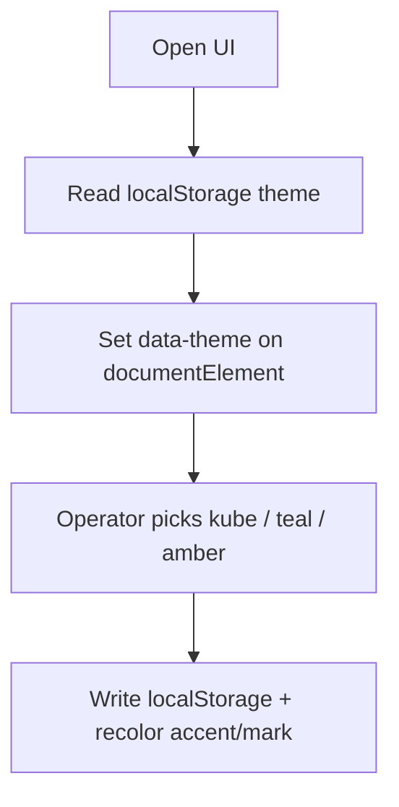

# Instruction: Theme tokens + in-app switcher

## Architecture projection

```txt
crates/proteus-ui/
├── assets/styles.css     ✏️ :root + [data-theme=kube|teal|amber] accent tokens
├── src/theme.rs          ✅ Theme enum, localStorage load/save, apply data-theme
├── src/main.rs           ✏️ provide theme signal / init on App
└── src/shell.rs          ✏️ theme control (phase 3 may place UI; logic here or shell)
```

## User Journey



## Wireframe

```txt
┌──────────┬─────────────────────────────────────┐
│ (1) Brand│ (3) Page content (unchanged)         │
│  mark+wm │                                      │
│ (2) Nav  │                                      │
│  links   │                                      │
│          │                                      │
│ (4) Theme│                                      │
│  kube    │                                      │
│  teal    │                                      │
│  amber   │                                      │
└──────────┴─────────────────────────────────────┘
```

1. Brand: mark + wordmark (phase 3).
2. Nav links: existing routes.
3. Main: no UX redesign.
4. Theme: three options to compare accents.

## Tasks to do

### `1)` CSS theme tokens

> Map `--accent` (and related) under `data-theme`.

1. Keep dark surfaces; only retarget accent family
2. `kube`: `#3069de`; `teal`: `#3d9a7a`; `amber`: `#d4a017` (tune secondary as needed)
3. Default attribute / `:root` = `kube`

### `2)` Theme state in Rust

> Enum + persist + apply to DOM.

1. `Theme { Kube, Teal, Amber }` with string ids
2. Load from `localStorage` (key e.g. `proteus-theme`); fallback `kube`
3. On change: set `document.documentElement` `data-theme`, save storage
4. Expose via Dioxus signal/context from `App`

## Test acceptance criteria

| Task | Acceptance criteria |
| ---- | ------------------- |
| 1 | Switching `data-theme` changes accent colors without breaking dark layout |
| 2 | Refresh keeps last selected theme; invalid storage falls back to kube |
