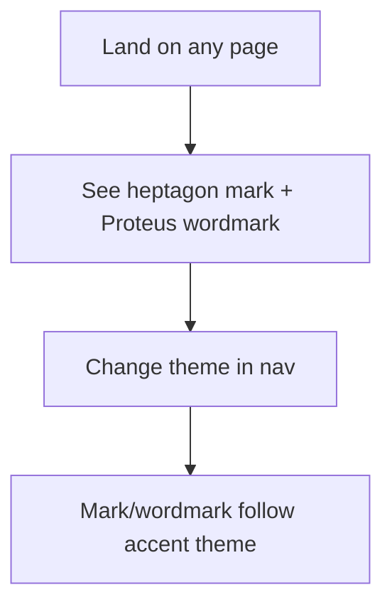

# Instruction: Shell brand chrome

## Architecture projection

```txt
crates/proteus-ui/src/
├── shell.rs     ✏️ replace letter-P mark; wordmark img/svg; theme control
├── main.rs      ✏️ favicon Link; theme provider if not already
└── theme.rs     (from phase 2)
assets/brand/    (from phase 1)
```

## User Journey



## Wireframe

```txt
┌────────────────────────┐
│ (1) [heptagon] PROTEUS │
│     Backup control     │
│────────────────────────│
│ (2) Cluster            │
│     Repositories       │
│     Backups            │
│     Inventory          │
│────────────────────────│
│ (3) Theme              │
│     ( ) kube           │
│     ( ) teal           │
│     ( ) amber          │
└────────────────────────┘
```

1. Brand row: mark + wordmark SVG (not Plex “Proteus”); optional muted subtitle kept.
2. Existing nav links.
3. Theme compare control (compact; ops-utilitarian, not marketing chrome).

## Tasks to do

### `1)` Brand row

> Remove CSS letter-mark `P`; use brand assets.

1. Mark image/SVG from `assets/brand/`
2. Wordmark SVG beside it (layout A)
3. Mark/wordmark color tracks active theme (`currentColor` or per-theme asset)

### `2)` Theme control + favicon

> Operator can switch themes; tab icon is mark.

1. Place theme control in shell (footer of nav)
2. `document::Link` favicon in `App`
3. No page UX changes beyond tokens already cascading

## Test acceptance criteria

| Task | Acceptance criteria |
| ---- | ------------------- |
| 1 | Nav shows heptagon+shield and SVG wordmark; no letter-only `P` mark |
| 2 | Theme control switches accents live; favicon is the mark |
