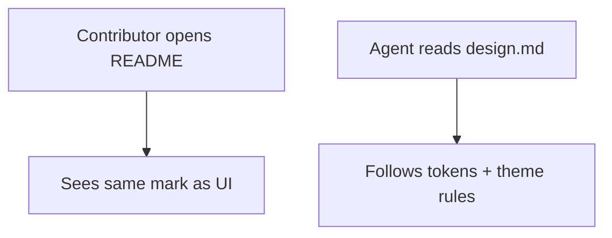

# Instruction: Docs + README surface

## Architecture projection

```txt
aidd_docs/memory/design.md     ✏️ locked brand system (tokens, assets, themes)
README.md                      ✏️ header mark/lockup instead of text-only
crates/proteus-ui/assets/brand/README.md  (phase 1; ensure complete)
```

## User Journey



## Tasks to do

### `1)` design.md

> Source of truth for future UI work.

1. Brand brief: heptagon+shield, Kube-inspired blue, wordmark O
2. Asset paths + theme ids (`kube` / `teal` / `amber`) + default
3. Replace “utilitarian only / letter P” guidance

### `2)` README

> Public surface matches product mark.

1. Add mark or compact lockup at top
2. Keep install prose; no marketing landing overload

## Test acceptance criteria

| Task | Acceptance criteria |
| ---- | ------------------- |
| 1 | `design.md` describes mark, wordmark, three themes, default `kube` |
| 2 | README shows the brand mark (not letter-P placeholder) |
